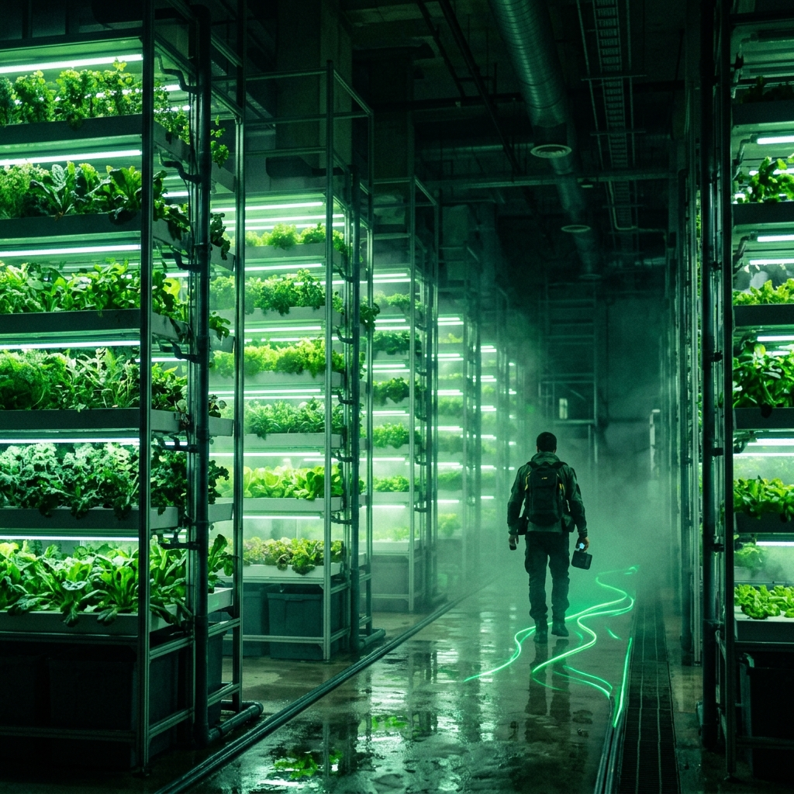

# VERDANT — Sustainable AI Urban-Farming Platform

> A bioluminescent command center for vertical urban farms, powered by real machine-learning models.



---

## What it does

| Module | Description | Tech |
|---|---|---|
| **Plant Doctor** | Upload a leaf → disease class + confidence + treatment & prevention plan | Vision Transformer |
| **Species Scanner** | Upload a plant photo → species ID + tailored grow profile | Vision Transformer |
| **AI Advisor** | Ask any agronomy question → RAG answer grounded by curated knowledge base | Gemma 3 + Sentence-Transformer |

---

## Machine-learning models

| Task | Model | Architecture |
|---|---|---|
| Disease diagnosis | [`wambugu71/crop_leaf_diseases_vit`](https://huggingface.co/wambugu71/crop_leaf_diseases_vit) | Vision Transformer — 98% val acc |
| Species identification | [`dima806/medicinal_plants_image_detection`](https://huggingface.co/dima806/medicinal_plants_image_detection) | Vision Transformer — 52 species |
| Advisor retrieval | [`sentence-transformers/all-MiniLM-L6-v2`](https://huggingface.co/sentence-transformers/all-MiniLM-L6-v2) | Sentence-Transformer 384-d |
| LLM generation | Gemma 3 via [Ollama cloud](https://ollama.com) | Ollama API |

Inference runs **locally on CPU** via 🤗 `transformers` + `sentence-transformers`. Weights are downloaded from HuggingFace Hub on first run (~500 MB total) and cached.

---

## Architecture

```
browser ──► React + Vite (frontend/)
              Tailwind v4 · Framer Motion
                    │
              /api (Vite proxy)
                    │
            FastAPI (backend/app/)
            /diagnose  /identify  /advisor  /health
                    │
        ┌───────────┴────────────┐
   🤗 transformers          sentence-transformers
   (ViT disease + species)   (all-MiniLM-L6-v2)
                    │
             Ollama cloud API
             (Gemma 3 LLM for advisor)
```

---

## Quick start

### 1 — Pre-download models (once)

```powershell
cd backend
.venv\Scripts\python download_models.py
```

This caches all three HuggingFace models locally so the server starts instantly.

### 2 — Backend

```powershell
cd backend
python -m venv .venv
.venv\Scripts\python -m pip install -r requirements.txt
.venv\Scripts\python -m uvicorn app.main:app --port 8000
```

Create `backend/.env` with your Ollama API key (optional — advisor falls back to KB-only if missing):

```env
OLLAMA_API_KEY=your_key_here
OLLAMA_MODEL=gemma3:4b
```

### 3 — Frontend

```powershell
cd frontend
npm install
npm run dev
```

Open http://localhost:5173. On Windows, `./start.ps1` launches both in separate terminals.

---

## Project layout

```
Urban Farm/
├─ frontend/              React + Vite SPA
│  ├─ public/assets/      generated imagery (hero, botanical, brand, feature)
│  └─ src/
│     ├─ components/      Sidebar, Topbar, Uploader, UI kit
│     ├─ sections/        Landing, Overview, PlantDoctor, Scanner, Advisor
│     └─ lib/             API client, data, helpers
├─ backend/               FastAPI ML service
│  ├─ app/                main.py · ml.py · knowledge.py
│  └─ download_models.py  pre-download HuggingFace weights
└─ assets/                raw source images
```

---

## Design

Bespoke **"bioluminescent tech"** aesthetic — near-black canvas, emerald/lime neon glow, frosted glass cards, canvas fireflies, and a HUD style. All botanical imagery uses true alpha-transparent PNGs. Fonts: Space Grotesk · Inter · JetBrains Mono.
